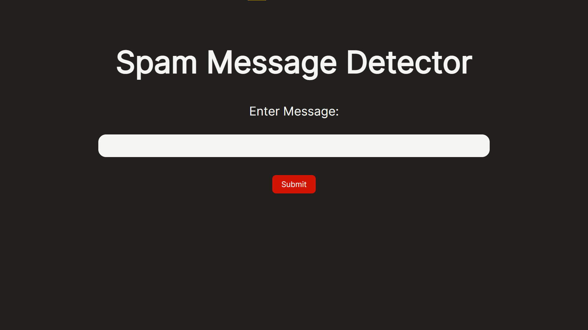

# Spam-or-Ham-Classifier

A Flask web application that applies NLP (Natural Language Processing) to detect spam messages



## Table of Contents
- [Motivation and Outcomes](#motivation-and-outcomes)
- [Technologies](#technologies)
- [Installation](#installation)
- [Features](#features)
- [Project Status](#project-status)
- [Sources](#sources)

## Motivation and Outcomes
After completing the LinkedIn Learning course
[NLP with Python for Machine Learning Essential Training](https://www.linkedin.com/learning/nlp-with-python-for-machine-learning-essential-training?u=55034593),
I wanted to go beyond only knowing how to train an NLP model in Jupyter Notebooks.
I knew Python could be used as a backend for webpages, but I didn't know how it would be implemented.
After researching backend web development with Python I came across the Flask framework which met my needs.
Through this project I was able to design a simple web form and learn about backend development while applying my machine learning knowledge.

## Technologies
This project is created with:
- Python 3.10
- Flask 2.2.2
- nltk 3.7
- pandas 1.4.1
- scikit-learn 1.0.2

## Installation
1. Clone the repository
```
$ git clone https://github.com/Lin-Ian/Spam-or-Ham-Classifier.git
```
2. Install Requirements
```
pip install -r requirements.txt
```
3. Navigate to Web Application directory
```
$ cd App
```
4. Run
```
py main.py
```
Open the localhost link, and you're ready to check for spam messages now

## Features
- Enter messages into web form
- Use NLP model to classify the message as spam or ham

## Project Status
Project is: complete (with small finishing touches required)

## Sources
The development of the NLP model was based on the LinkedIn Learning course
[NLP with Python for Machine Learning Essential Training](https://www.linkedin.com/learning/nlp-with-python-for-machine-learning-essential-training?u=55034593)
